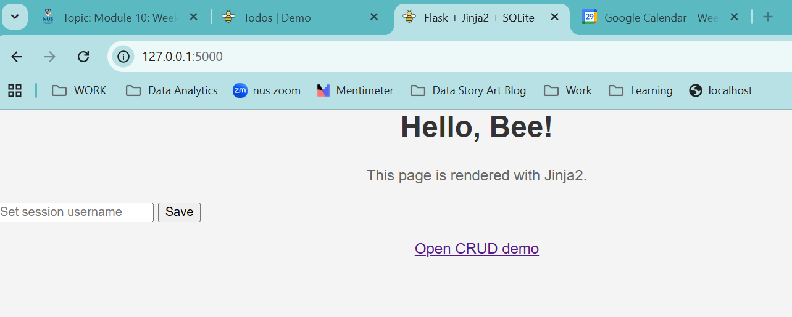
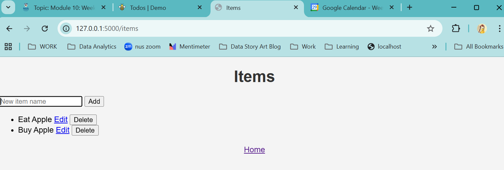

# Flask+Jinja2+SQLite

Compiled  by Tan Bee Hoon (contact: tbeehoon@gmail.com), dated 29 Sep 2025

This readme shows: 

1. Tasks Intro

2. Environment setup 

3. Project layout 

4. Flask with Jinja2 Template

5. Handle different HTTP methods in Flask

6. Manage session state using Flask sessions

7. Serve Static Asset

8. Database interaction and CRUD operations (SQLite)

9. Running the app

10. Git Version Control

    


## 1. Tasks Intro 

The assignment tasks to be included in this projects include:

**2. Flask with Jinja2 Template Engine** 

a) Set up a Flask web application with Jinja2 

b) Dynamic content rendering with Jinja2 

c) Handle different HTTP methods in Flask 


**3. Static Assets and Session Management ** 

c) Serve static assets in Flask 

d) Manage session state using Flask sessions 


**4. Database interaction and CRUD operations ** 

a Flask application to perform CRUD operations with SQLite. 


## 2. Environment Setup

### 2.1 Create & activate a virtual environment

Create a new directory:

```
mkdir mod10flask
cd mod10flask/
```

If uv not install yet: (using powershell)

```
irm https://astral.sh/uv/install.ps1 | iex
```

Do verification:

```
uv --version
```

Note: This installation using node version v22.19.0

Create and activate the virtual environment

```
uv venv .venv --python 3.12 
source .venv/Scripts/activate
```


### 2.2 Add dependencies with `uv pip`

Fast installs; writes to local `.venv`.

```
uv pip install flask
```

Verify Flask:

```
uv run -q python -c "import flask, sys; print('Flask', flask.__version__); print(sys.executable)"
```


## 3. Project layout 

Create these folders/files:

```
mod10flask/
├─ .venv/                  # Virtual environment directory
├─ app.py                  # Main Flask application file
├─ templates/
│   └─ index.html         # HTML template
├─ static/
│   └─ style.css          # CSS stylesheet
└─ database.db            # Empty database file
```


## 4. Flask with Jinja2 Template

Set up a Flask web application with Jinja2. 

Jinja2 is Flask’s renderer for HTML templates.

a) Edit the file app.py: 

```
from flask import Flask, render_template, request, redirect, url_for, session, flash
import sqlite3
from pathlib import Path

app = Flask(__name__)
app.secret_key = "change-me-in-production"  # needed for sessions & flash

DB_PATH = Path("database.db")

def get_db():
    conn = sqlite3.connect(DB_PATH)
    conn.row_factory = sqlite3.Row
    return conn

@app.route("/")
def home():
    # dynamic data passed to Jinja2
    return render_template("index.html", user=session.get("user", "Guest"))
    
```

The explanation for code above:

* imports the necessary packages. 
* Flask app setup
* Setup Database path & connection helper: This helper function (get_db) is used whenever the app needs to query the database.
* Route definition: makes the page dynamic, e.g. the template can greet the logged-in user by name or fall back to `"Guest"`

b) Edit the file templates/index.html : 

```
<html>
  <head>
    <meta charset="utf-8" />
    <title>Flask + Jinja2 + SQLite</title>
    <link rel="stylesheet" href="{{ url_for('static', filename='style.css') }}">
  </head>
  <body>
    <h1>Hello, {{ user }}!</h1>
    <p>This page is rendered with Jinja2.</p>

    <form method="post" action="{{ url_for('set_user') }}">
      <input name="username" placeholder="Set session username">
      <button type="submit">Save</button>
    </form>

    <p><a href="{{ url_for('logout') }}">Logout</a></p>
  </body>
</html>
```

The explanation for code above:

* `<form>` lets users submit data.
  - `method="post"` : sends data in the request body.
  - `action="{{ url_for('set_user') }}"` :tells the form where to send data.
    - `url_for('set_user')` generates the URL of the Flask route `@app.route("/set-user", methods=["POST"])`.
* `<input name="username">` : text box where user types their name.
* `<button type="submit">` :  submit button.
* When submitted, Flask’s `set_user` route will read `request.form["username"]` and save it in the session.


## 5. Handle different HTTP methods in Flask

In `app.py`:

```
@app.route("/set-user", methods=["POST"])
def set_user():
    session["user"] = request.form.get("username") or "Guest"
    flash("User saved in session.")
    return redirect(url_for("home"))
```

The function:

- Reads the username.
- Stores it in `session["user"]`.
- Flashes a success message.
- Redirects the browser to `/`.


## 6. Serve Static Asset

Flask serves static assests from `/static/...`, example below:

```
 <link rel="icon" type="image/png" href="{{ url_for('static', filename='bee-icon.png') }}">
 
 <link rel="stylesheet" href="{{ url_for('static', filename='style.css') }}">
```


## 7. Manage session state using Flask sessions

To track users across requests, set `app.secret_key` and used `session["user"]`.

The session state can also be cleared:

```
@app.route("/logout")
def logout():
    session.clear()
    flash("Logged out.")
    return redirect(url_for("home"))
```


## 8. Database interaction and CRUD operations (SQLite)

### 8.1 Set up CRUD with SQLite

To setup persistent data, include a simple file DB for demos.

Add a tiny table + CRUD routes to `app.py`:

```
from flask import Flask, render_template, request, redirect, url_for, session, flash
import sqlite3
from pathlib import Path

app = Flask(__name__)
app.secret_key = "change-me-in-production"  # needed for sessions & flash

DB_PATH = Path("database.db")

def get_db():
    conn = sqlite3.connect(DB_PATH)
    conn.row_factory = sqlite3.Row
    return conn

@app.route("/")
def home():
    # dynamic data passed to Jinja2
    return render_template("index.html", user=session.get("user", "Guest"))

@app.route("/set-user", methods=["POST"])
def set_user():
    session["user"] = request.form.get("username") or "Guest"
    flash("User saved in session.")
    return redirect(url_for("home"))

@app.route("/logout")
def logout():
    session.clear()
    flash("Logged out.")
    return redirect(url_for("home"))

def init_db():
    with get_db() as db:
        db.execute("""
            CREATE TABLE IF NOT EXISTS items (
                id INTEGER PRIMARY KEY AUTOINCREMENT,
                name TEXT NOT NULL
            )
        """)

# Initialize database when app starts
init_db()

@app.route("/items")
def list_items():
    with get_db() as db:
        items = db.execute("SELECT id, name FROM items ORDER BY id DESC").fetchall()
    return render_template("items.html", items=items)

@app.route("/items", methods=["POST"])
def create_item():
    name = (request.form.get("name") or "").strip()
    if name:
        with get_db() as db:
            db.execute("INSERT INTO items (name) VALUES (?)", (name,))
        flash("Item created.")
    return redirect(url_for("list_items"))

@app.route("/items/<int:item_id>/edit")
def edit_item(item_id):
    with get_db() as db:
        item = db.execute("SELECT id, name FROM items WHERE id=?", (item_id,)).fetchone()
    if not item:
        flash("Item not found.")
        return redirect(url_for("list_items"))
    return render_template("edit.html", item=item)

@app.route("/items/<int:item_id>/edit", methods=["POST"])
def update_item(item_id):
    name = (request.form.get("name") or "").strip()
    if name:
        with get_db() as db:
            db.execute("UPDATE items SET name=? WHERE id=?", (name, item_id))
        flash("Item updated.")
    else:
        flash("Name cannot be empty.")
    return redirect(url_for("list_items"))

@app.route("/items/<int:item_id>/delete", methods=["POST"])
def delete_item(item_id):
    with get_db() as db:
        db.execute("DELETE FROM items WHERE id=?", (item_id,))
    flash("Item deleted.")
    return redirect(url_for("list_items"))
```


### 8.2 Create the template for CRUD:

Edit the layout template in **templates/items.html.**

```
<!doctype html>
<html>
  <head>
    <meta charset="utf-8" />
    <title>Items</title>
    <link rel="stylesheet" href="{{ url_for('static', filename='style.css') }}">
  </head>
  <body>
    <h1>Items</h1>

    <form method="post" action="{{ url_for('create_item') }}">
      <input name="name" placeholder="New item name" required>
      <button type="submit">Add</button>
    </form>

    <ul>
      
        <li>
          {{ item.name }}
          <form method="post" action="{{ url_for('delete_item', item_id=item.id) }}" style="display:inline">
            <button type="submit">Delete</button>
          </form>
        </li>
      
        <li>No items yet.</li>
      
    </ul>

    <p><a href="{{ url_for('home') }}">Home</a></p>
  </body>
</html>
```

Add another template for editing items in edit.html:

```
<!doctype html>
<html>
  <head>
    <meta charset="utf-8" />
    <title>Edit Item</title>
    <link rel="icon" type="image/png" href="{{ url_for('static', filename='bee-icon.png') }}">
    <link rel="stylesheet" href="{{ url_for('static', filename='style.css') }}">
  </head>
  <body>
    <h1>Edit Item</h1>

    <form method="post" action="{{ url_for('update_item', item_id=item.id) }}">
      <input name="name" value="{{ item.name }}" placeholder="Item name" required>
      <button type="submit">Update</button>
      <a href="{{ url_for('list_items') }}">Cancel</a>
    </form>

    <p><a href="{{ url_for('list_items') }}">Back to Items</a></p>
  </body>
</html>
```


## 9. Running the app

Add the following to app.py:

```
if __name__ == "__main__":
    app.run(debug=True, host="127.0.0.1", port=5000)
```

Run the application:

```
uv run app.py
```

Open http://127.0.0.1:5000

For debugging, run:

```
uv run flask --app app run --debug --host 127.0.0.1 --port 5000
```


The output of the application looks like this:






### 10. Git Version Control

Version control the project using Git.

```
# Initialize a git repository
git init

# Add all project files
git add .

# Commit the files
git commit -m "Initial commit: setup project"
```

To add to Github.

```
# Add remote 
git remote add origin https://github.com/tbeehoon/module10Express.git

# Push changes
git branch -M main
git push -u origin main
```

> [!TIP]
>
> In case identity need to be authenticated:

```
git config --global user.email "you@example.com"
git config --global user.name "Your Name"
```

> [!TIP]
>
> In case you have accidentally create a remote origin and need to replace it:
>
> ```
> git remote set-url origin https://github.com/tbeehoon/module10Express.git
> ```
>
> To check:
>
> ```
> git remote -v
> ```


### 10.1 Setup .gitignore

Add a `.gitignore` file in the root of the project to exclude files and folders not required in version control. Some examples of items to include:

```
# Python
__pycache__/
*.py[cod]
*$py.class
*.so
.Python
build/
develop-eggs/
dist/
downloads/
eggs/
.eggs/
lib/
lib64/
parts/
sdist/
var/
wheels/
*.egg-info/
.installed.cfg
*.egg
MANIFEST

# Virtual Environments
venv/
env/
ENV/
.venv/
.env/

# Flask
instance/
.webassets-cache

# Database files (if you want to exclude the actual database)
database.db
*.db-journal
*.db-wal
*.db-shm

# Environment variables
.env
.flaskenv

# IDE/Editor files
.vscode/
.idea/
*.swp
*.swo
*~

# OS generated files
.DS_Store
.DS_Store?
._*
.Spotlight-V100
.Trashes
ehthumbs.db
Thumbs.db

# Logs
*.log
logs/

# Coverage reports
htmlcov/
.coverage
.coverage.*
coverage.xml
*.cover
.hypothesis/
.pytest_cache/

# Jupyter Notebook
.ipynb_checkpoints

# Flask-specific
flask_session/
```


@Q.E.D.